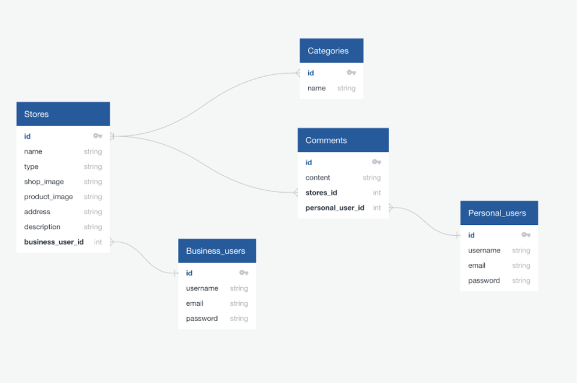
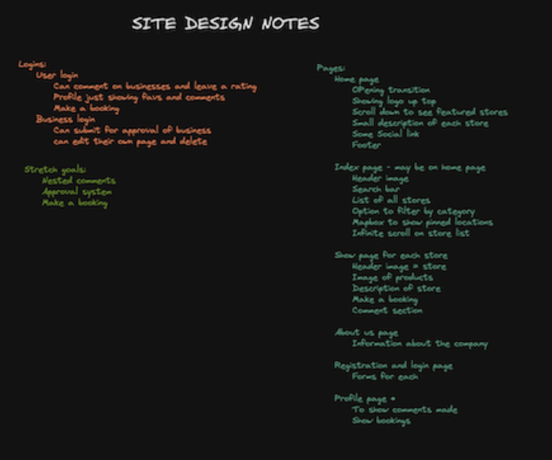
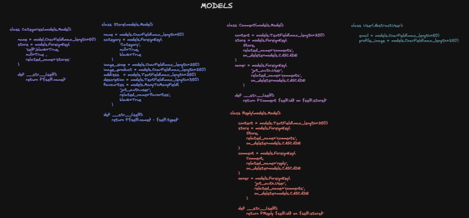
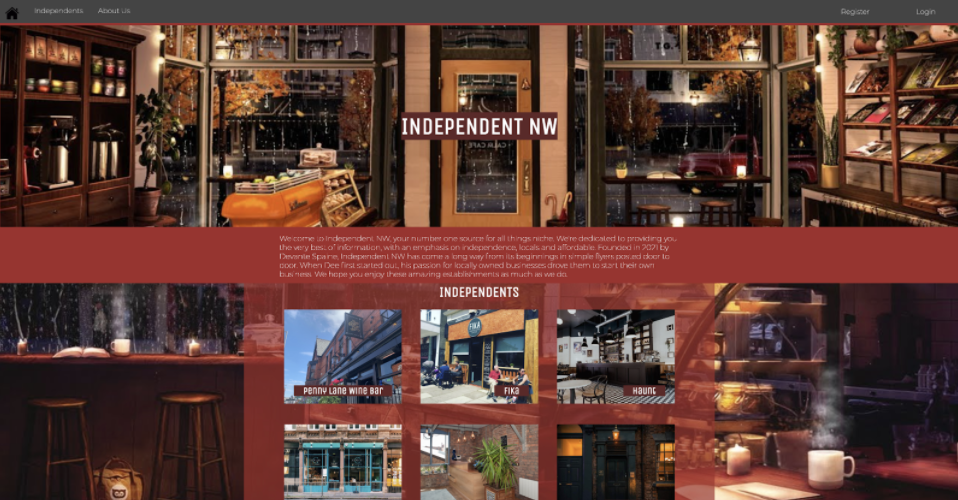
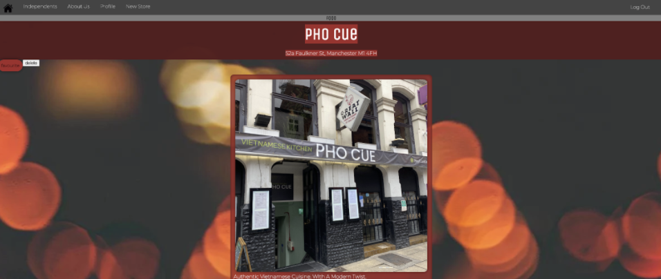
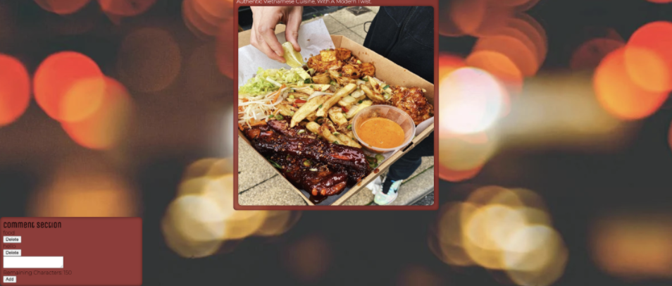
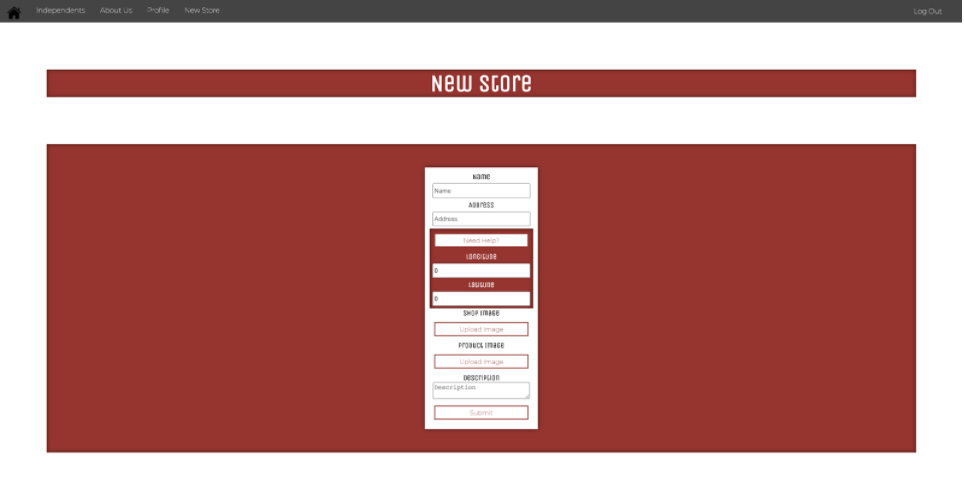

# Project 4: Independent NW

# Overview

Project 4 was my final and most free project during the course. We were given the option of working individually or in groups up to 3 people max. I decided to go for an **individual approach** as I wanted to have a final go of being involved in every aspect of the project and help solidify my understanding. The project was a **full stack application** but with **the backend being written in Python and the frontend in **React**, we could create any website we wanted and my idea came from the recent boom of **independent stores in the North-West of England. My site was inspired by Independent Liverpool** but with the inclusion of Manchester.


The full site is available [**here!**](https://independent-nw.netlify.app/).

# Brief

* **Build a full-stack application** by making your own backend and your own front-end.
* **Use a Python Django API** using Django REST Framework to serve your data from a Postgres database.
* **Consume your API with a separate front-end** built with React.
* **Be a complete product** which most likely means multiple relationships and CRUD functionality for at least a couple of models.
* **Implement thoughtful user stories/wireframes** that are significant enough to help you know which features are core MVP and which you can cut.
* **Have a visually impressive design** to kick your portfolio up a notch and have something to wow future clients & employers. **ALLOW** time for this.
* **Be deployed online** so it's publicly accessible.

# Technology used

* React
* Python
* Django
* PostgreSQL
* SASS
* Axios
* Git/ GitHub
* Cloudinary 
* Heroku
* Netlify


# The plan/ Wireframes

As with each project, time was taken to lay out a well thought out plan. 

* First I began with the relationships I knew I needed for the project.
* I was able to get more of an understanding of many to many relationships during this process.
* The overall setup was kept basic as there was no need to over complicate anything and this ensured a solid build without any confusion.




* After relationships were finished I began whiteboarding the screens I wanted.
* Models required were drafted up.
* Any additional thoughts I had were added to my notes section to refer back to incase I lost the train of thought whilst coding.





# The process

## Backend (Day 1 to 3)

The backend initially took 3 days to build where I could begin on the frontend, however, whilst I was working on the frontend I realised changes were needed on the backend so technically it went on longer than 3 days to completion.

### Models

Models were created for categories, stores, comments, and users. 

During planning:

* I realised categories should be its own model.
* Originally I had categories to be set up as a multi choice selection in the store model.
* Referencing the category model in the store model was easier.
* This made adding new categories a smoother process.

```Python
class Category(models.Model):
 
   name = models.CharField(max_length=50)
 
   def __str__(self):
       return f'{self.name}'
 
class Store(models.Model):
 
   name = models.CharField(max_length=50)
   category = models.ManyToManyField(
       'category',
       related_name='categories',
       blank=True
   )
   image_shop = models.CharField(max_length=250)
   image_product = models.CharField(max_length=250)
   address  = models.TextField(max_length=250)
   description = models.TextField(max_length=500)
   favourited_by = models.ManyToManyField(
       'jwt_auth.User',
       related_name='favourites',
       blank=True
   )
   owner = models.ForeignKey(
       'jwt_auth.User',
       related_name='owned_stores',
       on_delete=models.CASCADE,
       default=2
   )
   latitude = models.FloatField(
       validators=[MinValueValidator(-90), MaxValueValidator(90)],
       default=53.404068
   )
   longitude = models.FloatField(
       validators=[MinValueValidator(-90), MaxValueValidator(90)],
       default=-2.985266
   )
 
   def __str__(self):
       return f'{self.name}'

```
Whilst with the user model I opted to have the multi choice selection as there would only be two account types:

* Personal
* Business
``` Python
class User(AbstractUser):
 
   PERSONAL = 'Personal'
   BUSINESS = 'Business'
   account_type = [
       (PERSONAL,  'Personal'),
       (BUSINESS, 'Business'),
   ]
 
   type = models.CharField(
       max_length=8,
       choices=account_type,
       default=PERSONAL
   )
   email = models.CharField(max_length=50)
   profile_image = models.CharField(max_length=250)
```
The idea here was allow each account type to have different permissions in the final app:

Personal accounts:

* Leave reviews and comments on stores.
* Make bookings.
* Favourite stores.

Business accounts:

* Create stores.
* Contact admin.
* Reply to reviews and comment with nested comments.

### Views

Views were set up to be able to use the REST requests on the frontend. These were mostly unchanged from finishing the backend and moving to the front. The main addition was creating a view for GET requests.
```Python

class CategoryListView(APIView):
 
   def get(self, _request):
       categories = Category.objects.all()
       serilaized_categories = CategorySerializer(categories, many=True)
       return Response(serilaized_categories.data, status=status.HTTP_200_OK)

```
This was created due to wanting to display the store categories on their show page and this was a quick job and just added a nice touch to the site.

## Frontend (Day 3 to 9)

### Home page



* For the home page I wanted it to have a bit more to it than just a logo.
* I set up the design to show 6 featured stores.
* The 6 stores are randomly generated each time with the following code:

``` JavaScript
 function randomThree() {
   const nums = new Set()
   while (stores && nums.size < 6) {
     nums.add(Math.ceil(Math.random() * stores.length - 1))
   }
   return [...nums]
 }
 const [first, second, third, fourth, fifth, sixth] = randomThree()
```
* Then I can include the random numbers in the JSX like so:

```JavaScript
<Link to={`/stores/${first}/`}>
               <div className="cardScroll">
                 <h3 className="title">{stores[first].name}</h3>
                 
                 <div className="popUp">
                   <p>{stores[first].address}</p>
                 </div>
               </div> 
```
* Changing first to second then third and so on.
* With each page render new numbers are generated returning new stores each time.


### Index page


* This page includes a list of all the stores
```JavaScript
React.useEffect(() => {
   const getData = async () => {
     try {
       const { data } = await getAllStores()
       setStores(data)
     } catch (error) {
       console.log(error)
     }
   }
   getData()
 }, [])

```
* Store locations based on their longitude and latitude.
* Pins on mapbox showing the location. 
* A popup when clicked giving information.

### Show page





* The show page still has work to be done on it.
* Users can favourite a store and leave comments.
* The comment delete button does not work for now. 
* The store owner can delete their own store based on the authentication.

```JavaScript
{
             isOwner(store.owner) &&
             <>
               <button onClick={handleStoreDelete}>delete</button>
             </>
           }
 
export function isOwner(store) {
 const payload = getPayload()
 if (!payload || !isAuthenticated) return false
 return payload.sub === store
}

```

### New store/ form page



* For a new store to be created and appear on the mapbox map longitude and latitude need to be manually typed in.
* To make it easier I added a Need Help button which redirects users to a longlat converter.
* With having 2 image uploads I had to make separate folders in Cloudinary as uploading 2 files to the same folder at the same time threw a 422 unprocessable entity.
* For the double upload I was still able to tie them both together into one function:
```JavaScript
 const handleImageUpload = name => file => {
   setFormData({ ...formData, [name]: file })
 }
```

* The name will be filled in depending on where I call the handler.

```JavaScript
         <div>
           <label>Shop Image</label>
           <div>
             <ImageUpload name="imageShop" onUpload={handleImageUpload('imageShop')}/>
           </div>
         </div>
         <div>
           <label>Product Image</label>
           <div>
             <ProductUpload name="imageProduct" onUpload={handleImageUpload('imageProduct')}/>
           </div>
         </div>
```

# Challenges and wins

## Challenges

* PUT requests: I struggled getting put requests to work on the front end, it is an area I’m currently working on to understand better.

* Solo working: Working as an individual comes with its pros but not having anyone else to rely on made it harder when I wanted some feedback and advice.

## Win

* Solo working: I’m happy at the amount of work I managed to complete by myself and I feel I have a good overall understanding of the project as opposed to only segments as was with team projects.

* The Look: The design of the site came out better than I originally imagined with some tweeks needed here and there.

* Confidence: My confidence has massively grown through this project and I do believe that was in part to it being a solo project.

# What was learnt 

* Take the scope down and work on something you can complete and it will be a solid build.
* The use of custom hooks in React.
* How to work with Python and Django and how they compare to JavaScript back end in Mongoose and Express.
* Skills I need to work on:
	* RESTful Services, specifically PUT requests.
	* React hooks and their full usability.
	* Filtering.


# Bugs
* On the homepage the background of the lower section does not show.
* When searching on the index page the map moves into the new free space.
* Comments on the show page can’t be deleted with the delete button.
* Show page can’t be edited.

# Future development

* Add in a booking system so users can book seatings.
* Edit functionality for owned stores.
* Separate account types of personal and business.
